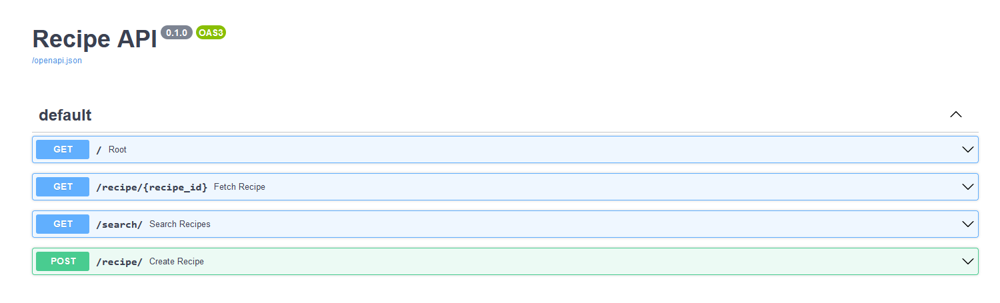
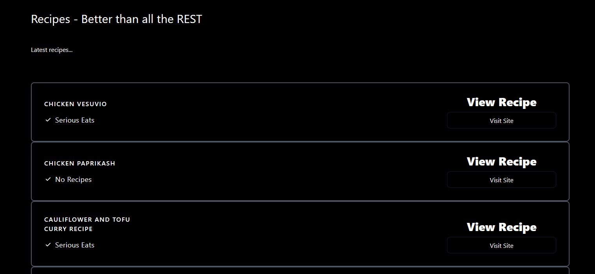

<h1 align="center">Learning fastAPI</h1>

    
    
    

The goal of this learning is to work with an API and build this API. The repository contains two directories :
- A directory for the beginning's part
- A directory for the intermediate's part

The beginning part is composed of :
- `helloworld` : this part is composed of the root endpoint
- `path_type` : this part is composed of the fetching of data includes in the API
- `query_params` : this part is composed of an endpoint with parameters into
- `pydantic` : this part is composed of the typing on the different endpoint
- `basic_errors` : this part is composed of the explanation about the raise of exceptions
- `jinja` : this final part is composed of the demonstration of the fetching data in a HTML file with jinja templates

The intermediate part is composed of : 